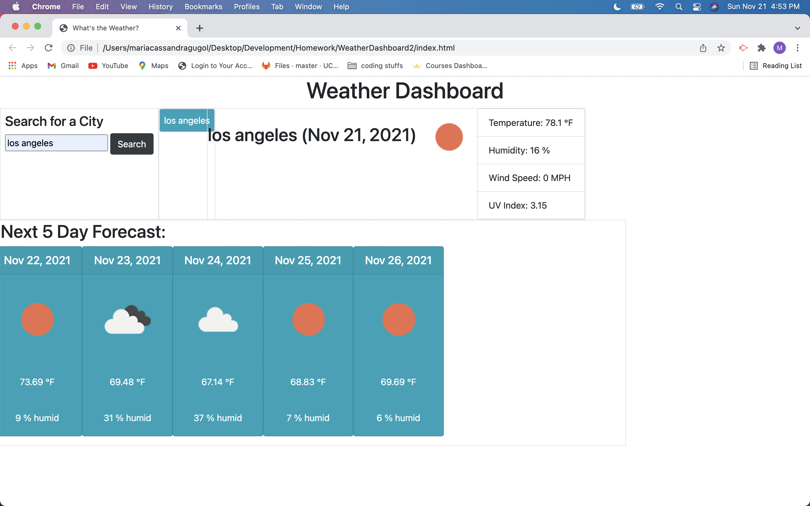

# WeatherDashboard2
I want to create a trip knowing what the weather is.

## Description  
 This app uses the OpenWeather API to retreive weather data, and Moment.js for time.   

## How it Works  
1. Search for a City
2. Search returns:  
    a. Name of the city.  
    b. Today's date.  
    c. Temperature.  
    d. Humidity.  
    e. Wind Speed.
    f. UV index.
    g. Next five days forecast.  
3. Searced cities are saved.  
4. When saved cities are clicked, their weather information can be seen. 

gitHub Repo: https://github.com/MCassandra/WeatherDashboard2   

link to live app: https://mcassandra.github.io/WeatherDashboard2/